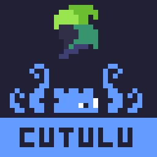

# The Cutulu SDK
Inherting its name from the lovecraftian being Cthulhu, this SDK serves as foundation for software projects powered by godot.

# Where to Start
The `Core.cs` file provides you with the essential utility known from other engines like unity. Fast debugging processes, static raycasting, simple mod support and save file managment, just to name a few of the utility tools provided in this SDK. Further you can investigate in the Modules folder to find awesome inventions and code adventures near and dear to me.

# Why OpenSource
Sole purpose of this SDK is to improve overall software products and their production cycles by providing optimized and efficient code foundations to almost tailored extend without needing to learn complex algorithms, writing far too many lines of code or producing flaws in the code due to forgetting details.

# History of Cutulu
Formerly called NarrenAPI or Raven the Narrenschlag SDK has gone through a lot of iterations. After switching from Unity to Godot and participating in the Franken Game Jam Bayreuth in Nov, 2023, a co jammer planted the seed of an open source library in my head. Since I am a big fan of Linux and GNU aswell as Godot and OpenSource in general I decided to publish it. As the SDK evolved with my personal experience it stands as my state of the art essence of what I personally think is needed to make high quality software development in no time a reality. Because a great artist can only become an icon if he has the right tools.

# Author
My name is Maximilian Schecklmann, also known as Narrenschlag or MaxNar and founder of the Narrenschlag Collective. My passion and profession is creating software, solving problems, creating art and enhancing the everyday experience of people. My coding journey started in game development and it's this heritage that I base all my interest and experience on till this day. As my personal ambition is to become the **Rodin** of my generation, I want to build my legacy by envoking emotion in people through art and high quality. By supporting this SDK you support my dream and as you support me you simultaneously support this project. Therefore. Thank you.

~ *Max*

# Development Support
As this is my personal library I will continue to develop this SDK for the newest versions of Godot with support for previous Godot 4.X versions. So do not worry about that. Further you can use most of the code for .Net and .Net Core independently as it's written mostly without Godot's utility. Feel free to take code snippets and fork this library but please do not forget the credit as it helps me on my personal mission.

# Networking
Decending from the .Net Core based networking library, the Cutulu Networking module provides you with everything you need to create an efficient network relying application. Highly efficient and well commented you only have to create you host script and your client script and send data without even parsing nor packaging it, as Cutulu's ByteFormatter handles that for you. Meaning you can send entire classes and structs without having to write a formatter. You can write one for special needs and edge cases but you can also just use the automatic packaging. That works as long as the two classes/structs are synced on server and client side. It is a great honor to present, as this features accompanies me on my development journey since 2020. Since August 2024 I provide a new closed-source networking library specially tailored for multiplayer and in particular coop games, called Colloseum. You can access it via DM. It is better suited for production level development and receives updates more often. Contained in Cutulu is the 6th generation of the Networking base. Supporting IPv6 and IPv4 cross support. Also enabling you to choose only one of them. Aswell as easy LAN and WAN address access.
### Read also:
- [Network Addons](./Network/Addons/README.md)

# Binary Encoding
Now in 4th generation the Binary Encoder serves as a simple to use Encoder for your custom types and classes. You can use the { get; set; } statements on public variables to make them encodable by default or write your custom Encoder. For special edge cases like, if you wanted to use rounded shorts instead of floats for your Vector3 encoding you can do that by writing a custom encoder and overriding the priority. This is espescially useful when you want to save or send huge amounts of data without the headache of json encoding.

# Mod and Patch Support
Near and dear to my heart is the ability mod modify software products. Comming from Skyrim and Minecraft Modding myself I know how exciting tinkering on mods and plugins can be. Also the ability to simply patch your own game without having to re install the whole game is pretty enticing. With the 4th generation of my modding solution you can easily take advantage of Godot's support and fully use it to you liking. Even enabling .dll C#, c++ and gdScript patching.

# Custom Input System
The 3rd generation of my input system, fully utilized in the Colloseum framework, provides you with easy access to custom input mapping, loading and saving input mapping presets, and epsescially a comfortable and performant work enviroment to utilize the system in you project. 

# Unity Migration
As I come from almost a decade of Unity Engine development I got used to a few functions of the engine. Therefore I added a lot of functions resemling the Unity way like Debug.Log() and Application.Quit(). Take a look at the respective scripts for further detail.
